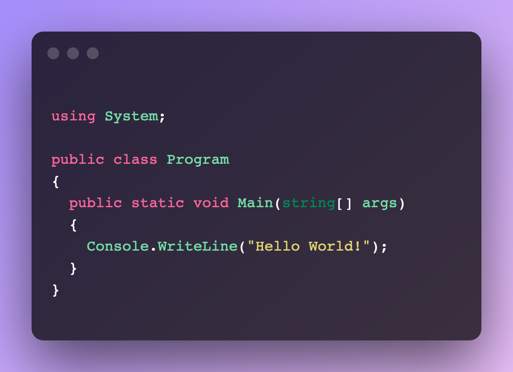

# Alfred Workflow for ray.so

https://ray.so is a little website to create stunning screenshots from code, supporting multiple languages, for example:

Invoke the workflow with `ray` or `ray <language>` whereas `<language>` is one of ray.so's [supported languages](https://github.com/raycast/script-commands/blob/master/commands/developer-utils/create-image-from-code.sh#L26).
The workflow will use the current clipboard as source for the code, transform it and opens your standard browser with ray.so with your code.

It uses the standard settings of ray.so.
Take a look at the global variables in the workflow to change the standard settings, as well as the default language (which currently is `csharp`).

## Transformations

As mentioned above, the workflow will do some transformations of your code before opening ray.so.

* Remove leading and trailing blank lines
* Tries to count leading empty space (spaces and tabs) in the first line of your code and then trim **all** lines with that count.
	* It _will_ fail on code that has keywords that are not intended, for example in C# with `#pragma`
	* I may resolve or make this feature optional in a later version.

## Dependencies

None

## Contribute

Feel free to open issues and pull requests.

## Download

Workflow is downlodable on the [Release page](https://github.com/boundfoxstudios/alfred-ray-so-workflow/releases)